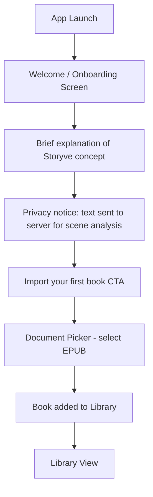
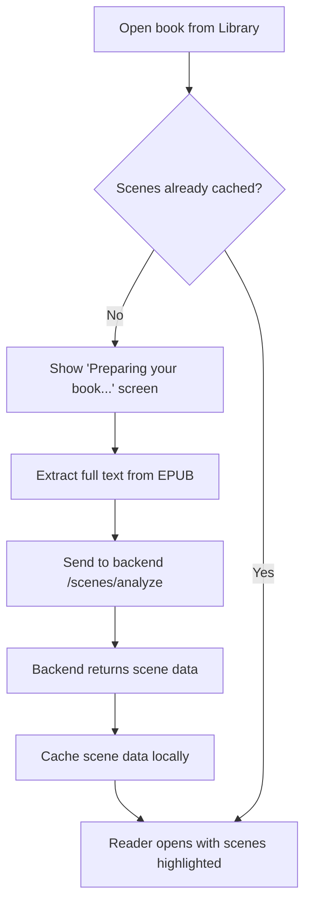
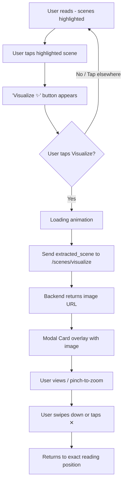
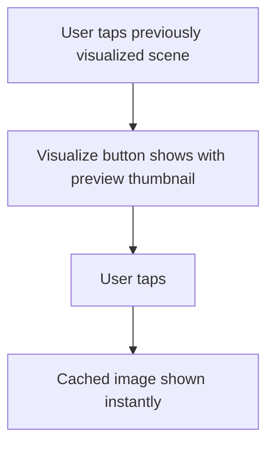

# Storyve — MVP Product Requirements Document

## 1. Vision & Problem Statement

**Vision:** Transform the reading experience by letting readers *see* the scenes they're reading — powered by AI-generated visualizations.

**Problem:** Reading is an imagination-driven activity, but not every reader can vividly picture scenes described in a book. Visual learners, language learners, and casual readers often lose engagement with dense descriptive passages.

**Solution:** Storyve is a reading app that intelligently identifies key visual scenes in a book and lets readers tap to generate an AI visualization of that scene — then seamlessly return to reading.

---

## 2. Target Users (MVP)

| Persona | Description |
|---------|-------------|
| **Casual Reader** | Reads for leisure on iPhone/iPad; values immersive, low-friction experiences |
| **Visual Learner** | Prefers visual aids to deepen comprehension of narrative content |
| **Early Adopter / Book Enthusiast** | Excited about AI-enhanced reading; willing to try new experiences |

**Platforms (MVP):** iPhone & iPad (iOS 17+). Mac support via Catalyst/iPad compatibility mode can follow.

---

## 3. Core Features — MVP Scope

### 3.1 📚 EPUB Reader

| Requirement | Details |
|-------------|---------|
| **Format Support** | EPUB 2 & EPUB 3 (reflowable content) |
| **Rendering** | Parse and display EPUB content with proper formatting (chapters, paragraphs, headings, inline styles, images) |
| **Navigation** | Table of Contents, chapter-by-chapter navigation, swipe/tap to paginate or scroll |
| **Reading Progress** | Track and persist current reading position per book |
| **Font & Display Settings** | Adjustable font size, font family (serif/sans-serif), line spacing, and light/dark/sepia themes |
| **Orientation** | Support portrait and landscape orientations |
| **Bookmarks** | Ability to bookmark pages/positions for quick access |

> [!NOTE]
> PDF support is explicitly **out of scope** for MVP but the architecture should be designed to accommodate additional format renderers in the future.

---

### 3.2 📖 Library / Book Management

| Requirement | Details |
|-------------|---------|
| **Import Books** | Users can import EPUB files via Files app (document picker), AirDrop, or share sheet |
| **Library View** | Grid/list view of imported books with cover art, title, author |
| **Cover Extraction** | Extract and display cover images from EPUB metadata |
| **Book Metadata** | Display title, author, description from EPUB metadata |
| **Delete Books** | Swipe-to-delete or edit mode to remove books from library |
| **Reading Progress Indicator** | Show percentage read or "New" / "Reading" / "Finished" status |

---

### 3.3 🎨 Scene Highlighting (Backend-Driven)

This is the **core differentiator**. The backend analyzes book content and identifies "scenes" — passages that are visually interesting and suitable for AI image generation.

#### Text Extraction & Scene Analysis Strategy

The app extracts the **entire book's text** from the EPUB upfront and sends it to the backend in a single request when the book is first imported or opened. This ensures:
- All scenes are pre-analyzed and ready before the user reaches them
- The backend has full book context for more relevant scene detection
- No per-chapter loading delays during reading

The app shows a **"Preparing your book..."** progress state during initial analysis. Results are cached locally so this only happens once per book.

**Text extraction approach:**
1. Parse EPUB spine to get ordered content documents
2. Strip HTML/XHTML tags from each content document
3. Normalize whitespace and remove formatting-only special characters
4. Concatenate into a single clean text payload (typical novel: ~300KB–1MB)
5. Send to backend with a content hash for deduplication

#### Scene Matching

The backend returns `scene_text` for each scene, which is an **exact match** of the book's text after ignoring formatters and special characters from the EPUB. The app must perform fuzzy/normalized matching between the `scene_text` and the rendered EPUB content to locate and highlight the correct passages.

| Requirement | Details |
|-------------|--------|
| **Scene Detection** | On first open/import, extract full book text and send to backend for whole-book scene analysis |
| **Preparing State** | Show a "Preparing your book..." screen with progress indicator during initial analysis |
| **Highlight Rendering** | Identified scene passages are visually highlighted in the reader (e.g., subtle background tint, left border accent, or underline style) |
| **Highlight Style** | Non-intrusive — should feel like a gentle prompt, not a distraction. Think: a soft gradient glow or a thin left-border accent bar |
| **Scene Metadata** | Each scene has a `scene_text` (exact text match) and `extracted_scene` (opaque object sent as-is to LLM for visualization) |
| **Text Matching** | Normalize both EPUB-rendered text and `scene_text` (strip special chars, collapse whitespace) to find highlight ranges |
| **Caching** | Scene data is cached locally after the initial analysis — persisted across app sessions |
| **Offline Graceful Degradation** | If offline, the reader works normally — scenes simply aren't highlighted. Previously cached scenes are still shown |

> [!IMPORTANT]
> The highlight must feel **native to the reading experience**, not like a foreign overlay. This is critical for user trust and engagement.

---

### 3.4 🖼️ Scene Visualization Flow

This is the primary user interaction loop:

```
User reads → Sees highlighted scene → Taps highlight → "Visualize" button appears →
Taps "Visualize" → Loading animation → Image appears → User views image →
Dismisses image → Returns to exact reading position
```

#### 3.4.1 Tap Interaction

| Requirement | Details |
|-------------|---------|
| **Tap on Highlight** | Tapping anywhere within a highlighted scene passage triggers the interaction |
| **Visualize Button** | A floating "Visualize ✨" button/pill appears near the tapped text (tooltip-style or bottom sheet) |
| **Button Positioning** | Should not obscure the highlighted text; appear above or below the tapped area |
| **Dismiss** | Tapping elsewhere dismisses the button |
| **Haptic Feedback** | Light haptic on tap to confirm interaction |

#### 3.4.2 Image Generation & Display

| Requirement | Details |
|-------------|---------|
| **API Call** | On "Visualize" tap, send scene ID + scene text + surrounding context to backend |
| **Loading State** | Show an engaging loading animation (e.g., ink-wash reveal, particle effect, or shimmer card) with an estimated wait message |
| **Image Display — Overlay Mode** | The generated image appears as a **modal overlay / card** on top of the reader content |
| **Image Resolution** | Optimized for device screen (e.g., 1024×1024 or aspect-fit) |
| **Image Caching** | Once generated, the image is cached locally so re-tapping doesn't re-generate |
| **Pinch to Zoom** | Users can pinch-to-zoom on the generated image |
| **Scene Text on Image** | Optionally show the scene text excerpt as a caption below/over the image |
| **Error Handling** | If generation fails, show a friendly error with retry option |

#### 3.4.3 Returning to Reading

| Requirement | Details |
|-------------|---------|
| **Dismiss Gesture** | Swipe down or tap "X" to dismiss the image overlay |
| **Position Preservation** | Reading position MUST be preserved exactly — user returns to the same scroll/page position |
| **Transition Animation** | Smooth fade or slide transition back to the reader |
| **Re-access** | Previously generated images for a scene should be instantly re-accessible (cached) |

---

### 3.5 🖼️ Image Overlay — Modal Card Layout ✅

**Decision: Modal Card Overlay** — confirmed for MVP.

```
┌──────────────────────────┐
│  [Reader Text - blurred] │
│  ┌────────────────────┐  │
│  │                    │  │
│  │   Generated Image  │  │
│  │                    │  │
│  │                    │  │
│  ├────────────────────┤  │
│  │ "The forest opened │  │
│  │  into a clearing…" │  │
│  ├────────────────────┤  │
│  │   [✕ Close]        │  │
│  └────────────────────┘  │
│                          │
└──────────────────────────┘
```

| Detail | Implementation |
|--------|---------------|
| **Presentation** | Image appears as a centered card with rounded corners over blurred reader content |
| **Scene Caption** | Scene text excerpt shown below the image |
| **Dismiss** | Close button (✕) or swipe-down gesture |
| **Transition** | Smooth fade-in on appear, slide-down on dismiss |
| **Position** | Reading position is trivially preserved since the reader is untouched beneath the overlay |

> [!TIP]
> **Future consideration:** A full-screen "cinematic mode" can be added as an alternative viewing option in later versions.

---

## 4. API Contract (App ↔ Backend)

> [!NOTE]
> Backend is owned by the same developer. No authentication required for MVP. All endpoints are unauthenticated.

### 4.1 Scene Analysis (Whole Book)

```
POST /api/v1/scenes/analyze
```

**Request:**
```json
{
  "book_id": "uuid",
  "title": "Book Title",
  "author": "Author Name",
  "content": "Full book text extracted from EPUB (stripped of HTML/formatting)...",
  "content_hash": "sha256-of-content"
}
```

**Response:**
```json
{
  "scenes": [
    {
      "scene_text": "The forest opened into a vast clearing where ancient oaks stood like sentinels, their gnarled branches reaching toward a sky painted in shades of crimson and gold",
      "extracted_scene": {
        "// opaque object - internals irrelevant to the app": true,
        "// sent as-is to the LLM for image generation": true
      }
    }
  ]
}
```

**Key points:**
- `scene_text` is an **exact match** of the book text after stripping formatters and special characters
- `extracted_scene` is an opaque JSON object — the app stores it and sends it back as-is during visualization
- The app must perform **normalized text matching** to find `scene_text` within the EPUB-rendered content

### 4.2 Scene Visualization

```
POST /api/v1/scenes/visualize
```

**Request:**
```json
{
  "book_id": "uuid",
  "scene_text": "The forest opened into a vast clearing where ancient oaks stood like sentinels...",
  "extracted_scene": { "// opaque object from scene analysis response" : true }
}
```

**Response:**
```
Content-Type: image/png (or image/webp)
Body: raw image binary data
```

The backend returns the **image directly in the response body** as binary data (not a CDN link). The app reads the image from the response, displays it, and caches it locally to disk.

> [!NOTE]
> No authentication headers required for MVP. The app should still use versioned endpoints (`/api/v1/`). CDN-based image delivery can be added post-MVP for performance.

---

## 5. Non-Functional Requirements

| Category | Requirement |
|----------|-------------|
| **Performance** | Reader must feel native — 60fps scrolling/pagination, no jank when highlights render |
| **Offline Mode** | Books and cached scenes/images available offline. Scene analysis requires network |
| **Storage** | Efficient local storage — books stored in app sandbox, images cached with LRU eviction |
| **Accessibility** | VoiceOver support for reader content, Dynamic Type support for adjustable text |
| **Privacy** | Only publicly available / public domain books supported for MVP. User informed via onboarding that text is sent to server |
| **Battery** | Minimize background processing; don't pre-generate images unless user requests |
| **Localization** | English-only for MVP; architecture should support i18n |

---

## 6. Tech Stack Considerations

| Component | Decision |
|-----------|----------|
| **UI Framework** | SwiftUI (primary) with UIKit interop where needed |
| **EPUB Rendering** | **Readium Swift Toolkit** ✅ — handles parsing, pagination, styling, annotation overlays, and accessibility |
| **Text Rendering** | Readium's built-in WKWebView-based renderer |
| **Text Extraction** | Readium's content APIs to extract clean text from EPUB for backend scene analysis |
| **Networking** | `URLSession` with async/await (no auth needed for MVP) |
| **Local Storage** | SwiftData or Core Data for metadata; FileManager for book/image files |
| **Image Caching** | `NSCache` + disk cache (or `Kingfisher`/`SDWebImage`) |
| **Architecture** | MVVM with Swift Concurrency (async/await, actors) |
| **Target** | iOS 17+, iPadOS 17+ |

---

## 7. Out of Scope (MVP)

These features are **not** in MVP but should be considered for future versions:

| Feature | Notes |
|---------|-------|
| PDF support | Next format to add post-MVP |
| User accounts / auth | No auth for MVP; add later for personalization and usage tracking |
| Cloud sync | Sync library/progress across devices — post-MVP |
| Social sharing | Share visualized scenes on social media |
| Image style customization | Let users pick art styles (realistic, anime, watercolor, etc.) |
| Custom highlight annotations | User-created highlights and notes |
| Text search | Full-text search within a book |
| Audiobook integration | Play narration alongside text |
| Store / purchase books | MVP uses user-imported EPUBs only |
| Mac-native app | iPad app on Mac via Catalyst is acceptable for MVP |
| Multiple images per scene | Generate variations or sequential images |
| Scene gallery | A gallery view of all generated images for a book |
| Reading statistics | Track reading time, pages read, etc. |

---

## 8. MVP User Flows

### Flow 1: First Launch


### Flow 2: First Book Open (Scene Preparation)


### Flow 3: Reading & Visualization


### Flow 4: Re-accessing a Visualization


---

## 9. Success Metrics (MVP)

| Metric | Target |
|--------|--------|
| **EPUB load success rate** | > 95% of standard EPUB files |
| **Scene detection relevance** | > 70% of highlighted scenes feel "right" to users (qualitative) |
| **Visualization generation time** | < 10 seconds (backend SLA) |
| **Reader performance** | 60fps scrolling, < 1s chapter load |
| **Crash-free rate** | > 99% |
| **Image cache hit rate** | > 90% for previously generated scenes |

---

## 10. Milestones & Phased Delivery

### Phase 1: Core Reader (Week 1–2)
- [ ] EPUB parsing and rendering
- [ ] Library view with book import
- [ ] Basic reader navigation (chapters, pagination)
- [ ] Reading position persistence
- [ ] Font/theme settings

### Phase 2: Scene Integration (Week 3–4)
- [ ] Full-book text extraction from EPUB
- [ ] Backend scene analysis API integration (whole-book)
- [ ] Normalized text matching (scene_text → EPUB content)
- [ ] Scene highlight rendering in reader
- [ ] "Preparing your book..." loading state
- [ ] Tap interaction and "Visualize" button
- [ ] Scene data caching (persist across sessions)

### Phase 3: Visualization (Week 5–6)
- [ ] Image generation API integration
- [ ] Loading animation
- [ ] Image overlay (Modal Card)
- [ ] Image caching
- [ ] Dismiss and return-to-position flow

### Phase 4: Polish & Launch Prep (Week 7–8)
- [ ] Onboarding flow
- [ ] Error handling and edge cases
- [ ] Accessibility pass (VoiceOver, Dynamic Type)
- [ ] Performance optimization
- [ ] TestFlight beta

---

## 11. Resolved Decisions

| Question | Decision |
|----------|----------|
| **Image overlay layout** | ✅ **Option A — Modal Card Overlay** |
| **Backend ownership** | ✅ Owned by the developer. Tightly coupled API contracts. Response format: `{scene_text, extracted_scene}` |
| **EPUB rendering** | ✅ **Readium Swift Toolkit** |
| **Authentication** | ✅ No authentication for MVP |
| **Usage limits** | ✅ No limits on visualizations for MVP |
| **Book content privacy** | ✅ Only publicly available / public domain books supported for MVP |
| **Text extraction** | ✅ Whole-book text extraction upfront, sent in a single API call |
